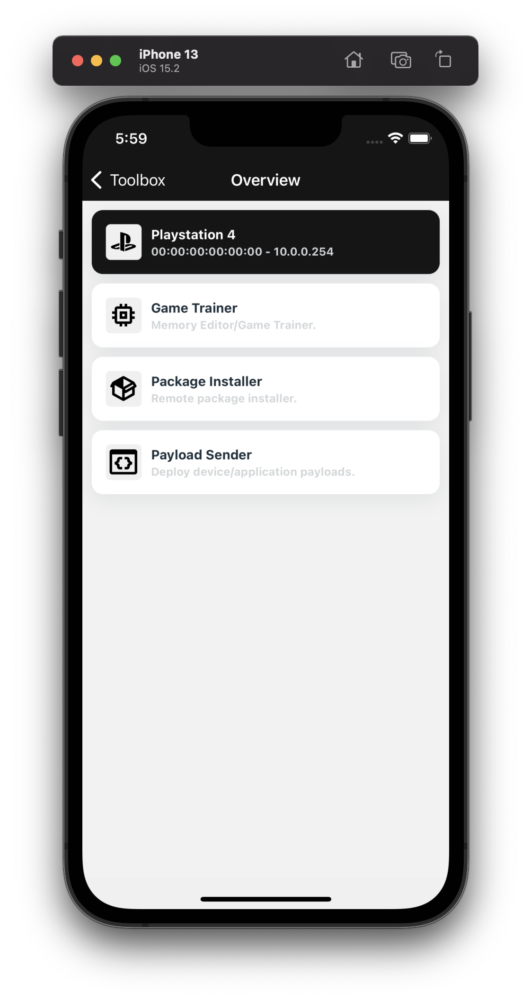

# PS Toolbox
Companion App (React Native) for various PS4(5?) Payloads.

# WIP
personal project, only trainer stuff done so far.
credits will be added prior to final release.
probable/unlikely this works OOB on android.

## Features
- PS4 Trainer integration. ( +auto match app )
- HTTP host (with intention of self hosting exploit server)

## Partial
- trigger install of payload(bin) from app
- trigger install of packages from app

## TODO
- search LAN for playstation devices
- global state/config etc etc.